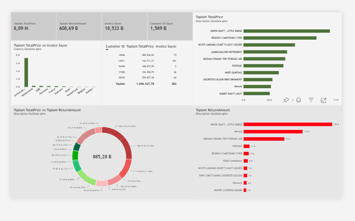

#  E-Ticaret Satış ve İade Analizi (2010 - 2011)

Bu projede, **Online Retail II** veri setini kullanarak bir e-ticaret şirketinin satış performansını, iade kayıplarını ve müşteri harcama alışkanlıklarını analiz edilmiştir. 

Projenin temel amacı, ham verilerden anlamlı içgörüler elde edilmesi ve karar vericilerin temel performans göstergelerini tek bir ekran üzerinden takip edebilmesini sağlayan bir yönetici panosu oluşturulmasıdır.

##  Dashboard

---

##  Kullanılan Araçlar ve Analiz Süreci

### 1. Excel ile Veri Ön Hazırlığı ve Temizleme
  * Ham veri setindeki eksik (`null`) müşteri ID'lerini ve analiz dışında bırakılan kayıtları filtrelendi.
  * Başında 'C' kodu olan iptal/iade faturaları ile normal satış hareketlerini mantıksal olarak birbirinden ayırıldı.
  * Veriyi veri tabanına ve analize en uygun olacak şekilde **`sales` (satışlar)** ve **`returns` (iadeler)** olmak üzere iki ayrı yapıya dönüştürüldü.

### 2. SQL ile Veri Analitiği & İş Mantığı
  * Satış ve iade hareketlerini ayırıp toplam satır sayılarını doğrulandı.
  * Gruplamalar (`GROUP BY`), tekil sayımlar (`COUNT DISTINCT`) ve filtreler kullanarak ciro, iade ve sepet ortalamaları çıkarıldı.
  * Satış ve iadeleri `CTE` ve `JOIN` yapılarıyla birleştirerek ürün bazında gerçek net ciroları hesapları gerçekleştirildi.

### 3. Power BI ile Görselleştirme:
  * Üst kısma en kritik metrikleri (Brüt Satış, İade, Sipariş ve Müşteri Sayısı) KPI kartı kullanılarak sunuldu.
  * Satışları **yeşil**, iadeleri ise **kırmızı** tonlarda vurgulayarak görsel olarak birbirinden ayrıştırıldı.
  * En çok kazandıran ve en çok iade edilen ilk 10 ürünü, ülke dağılımlarını ve en çok harcayan ilk 5 müşteriyi görselleştirildi.

---

##  Çıkarılan Önemli Notlar & Sonuçlar
* **Ciro & İade Dengesi:** Şirketin toplam brüt satış tutarı yaklaşık 8.69 M £ , toplam iade tutarı ise yaklaşık 603.75 K £ olarak hesaplanmıştır. 
* **Ortalama Sepet:** Sipariş başına ortalama harcama tutarı **469.16 £**.
* **Pazar Hacmi:** Sipariş ve cironun büyük çoğunluğu **Birleşik Krallık (İngiltere)** kaynaklı olduğu görülmüştür.
* **Ürün Detayı:** `Paper Craft, Little Birdie` ürünü en yüksek ciroya sahip ürün olarak görülmüş fakat bununla birlikte en büyük iade oranına sahip ürünler arasında da yer almaktadır. 

---

## 📁 Dosyalar
* `ecommerce_analysis_queries.sql`: Yazdığım ve optimize ettiğim 8 analitik SQL sorgusu.
* `Online Retail Dashboard.pbix`: Tasarladığım Power BI panosu ve veri modeli.
* `E-Ticaret_Satis_Analiz_Raporu.docx`: Detaylı analiz ve raporlama dökümanı.
* `image.png`: Panonun ekran görüntüsü.
